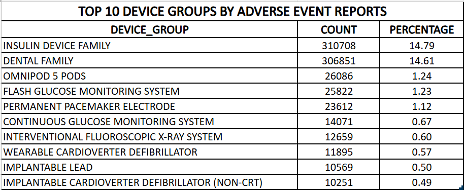
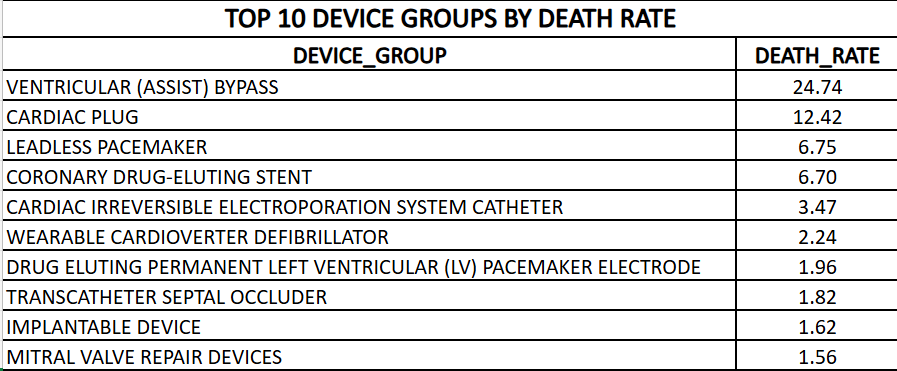
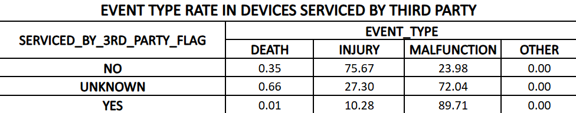
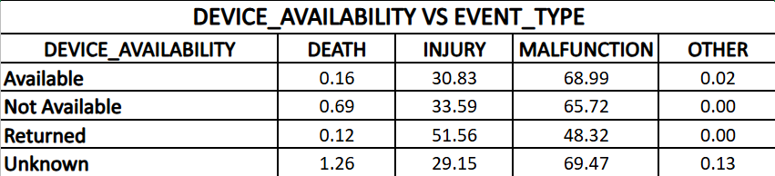
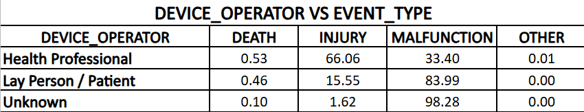

# FDA-MAUDE-Data-Analysis-2025
Analysis of FDA MAUDE adverse event data to identify device safety patterns. Combined multiple datasets, performed data cleaning and aggregation, and uncovered insights on high risk device categories, servicing impact and reporting trends.

## Project Overview
This project analyzes adverse event reports from the FDA MAUDE (Manufacturer and User Facility Device Experience) database to identify patterns in medical device safety, reporting behavior, and risk factors.

The goal is to uncover meaningful insights related to:

- Device related adverse events
- Manufacturer vs third party servicing impact
- Device categories with higher reporting volume
- Death and malfunction trends

## Dataset
The data is sourced from the FDA MAUDE database, which contains millions of medical device reports including:

- Event type (Death, Injury, Malfunction, Other)
- Device information
- Manufacturer details
- Patient and operator information

## Data Cleaning and Preparation
Key preprocessing steps included:

- Merging multiple FDA datasets into a unified dataset
- Handling missing and invalid values (e.g., '*', malformed codes)
- Standardizing categorical variables:
  - DEVICE_OPERATOR_CLEAN
  - DEVICE_AVAILABILITY_CLEAN
  - GENERIC_NAME_CLEAN
- Removing irrelevant categories such as "NO MATCH"

## Data Note
The full dataset (~800MB) is not included due to size constraints.  
A cleaned sample dataset is provided for demonstration.  
All analysis steps can be reproduced using the original FDA MAUDE data.

## Key Analyses
### 1. Top Reported Device Groups

- Identified top device categories based on report volume
- Calculated percentage contribution to total reports

Insight: Insulin devices and dental devices dominate reporting (~30% combined)

### 2. Death Rate by Device

- Calculated proportion of death events relative to total reports per device
- Applied minimum report threshold to avoid noise

Insight: Some lower volume devices show disproportionately high death rates

### 3. Third Party Servicing Impact

- Compared event distribution across:
  - Manufacturer-serviced devices
  - Third-party serviced devices

Insight: Third-party serviced devices show higher malfunction proportions

### 4. Device Availability Analysis

- Studied how availability status relates to event types
- Categories:
  - Available
  - Returned
  - Not Available
 

Insight: Returned devices show relatively higher injury proportions

### 5. Device Operator Analysis

- Compared event types by operator:
  - Health professionals
  - Patients
  - Unknown
 

Insight: Health professionals report more injuries, patients predominantly report malfunctions

### 6. Product Code Mapping

- Mapped FDA product codes to device names for interpretability
- Generated top product code list with corresponding device names

## Tools & Technologies

- Python
- Pandas
- Jupyter Notebook / VS Code
- Excel (for final presentation tables)

## Outputs

Generated CSV outputs include:

- top_30_death_devices.csv
- death_rate.csv
- third_party_event_rate.csv
- device_available.csv
- operator_event.csv
- device_report_product_code.csv

All outputs are consolidated in a docx file and is untouched.

## Limitations

- Dataset is observational and may contain reporting bias
- Missing/invalid entries were excluded where necessary
- Event counts do not directly imply causation

## Key Takeaways

- Device reporting is highly skewed toward a few categories
- Third-party servicing may be associated with higher malfunction rates
- Data quality plays a significant role in interpreting healthcare datasets
- Proper cleaning and validation are critical before drawing conclusions

## Conclusion

This project demonstrates end-to-end data analysis, including data cleaning, transformation, aggregation, and insight generation on a real-world healthcare dataset.

